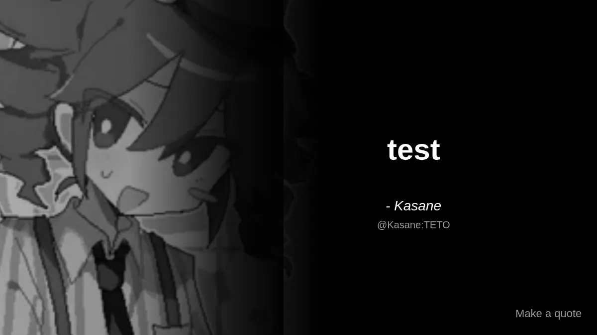

# Quote Bot for Nerimity

A bot that generates beautiful quote images from messages on Nerimity.



## Features

- 📸 Generates quote images with user avatar
- 🎨 Dark theme with gradient background  
- ✨ Clean, modern design
- ⚡ Fast image generation with Canvas

## Setup

1. **Install dependencies:**
```bash
npm install
```

2. **Configure your bot token:**
```bash
cp .env.example .env
# Edit .env and add your Nerimity bot token
```

3. **Run the bot:**
```bash
npm start
```

## Usage

1. Reply to any message in a channel
2. Mention the bot (e.g., `@QuoteBot`)
3. The bot will generate a quote image from the message you replied to

## Requirements

- Node.js 18+ 
- A Nerimity bot token ([create one here](https://nerimity.com))

## Contributing

Contributions are welcome! Please read [CONTRIBUTING.md](CONTRIBUTING.md) for:
- How to report bugs and request features
- Development setup and coding standards
- Pull request process

See also: [Issue Templates](.github/ISSUE_TEMPLATE/)

## License

This project is licensed under the MIT License - see [LICENSE](LICENSE) for details.
